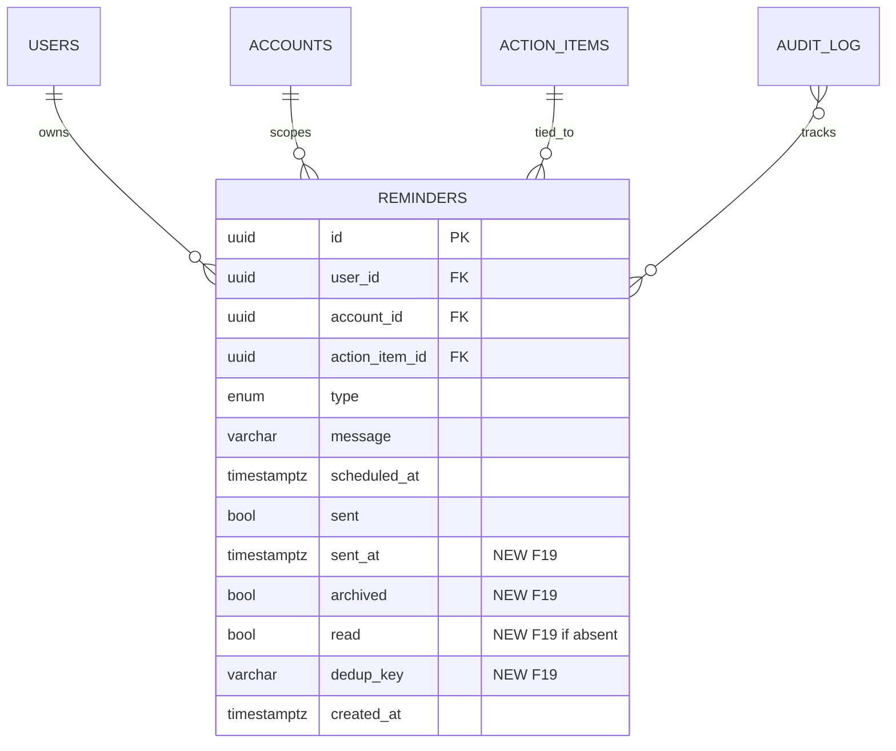

# Data Model: F19 — Cron Dispatcher Rappels + Auto-création

**Phase 1 output** | **Date** : 2026-05-07

## Vue d'ensemble

F19 étend la table existante `reminders` avec 3 colonnes (potentiellement 4) et 2 indexes. Aucune nouvelle table n'est créée. L'extension est rétro-compatible (colonnes nullable / default false).

## Table `reminders` (extension)

### Schéma actuel (avant F19)

| Colonne | Type | Nullable | Default | Notes |
|---------|------|----------|---------|-------|
| `id` | UUID | NO | gen_random_uuid() | PK |
| `user_id` | UUID | NO | — | FK users.id ON DELETE CASCADE |
| `account_id` | UUID | YES | — | F02 multi-tenant, FK accounts.id ON DELETE RESTRICT |
| `action_item_id` | UUID | YES | — | FK action_items.id ON DELETE CASCADE |
| `type` | reminder_type_enum | NO | — | enum 5 valeurs |
| `message` | VARCHAR(500) | NO | — | |
| `scheduled_at` | TIMESTAMPTZ | NO | — | quand le rappel devient dû |
| `sent` | BOOLEAN | NO | false | dispatched ou non |
| `created_at` | TIMESTAMPTZ | NO | now() | |

### Nouvelles colonnes (ajoutées par migration 034)

| Colonne | Type | Nullable | Default | Notes |
|---------|------|----------|---------|-------|
| `dedup_key` | VARCHAR(255) | YES | NULL | clé déduplication format `{account_id}:{type}:{entity_id}:{trigger_date}` |
| `sent_at` | TIMESTAMPTZ | YES | NULL | timestamp du dispatch effectif (distinct de `sent: bool`) |
| `archived` | BOOLEAN | NO | false | flag housekeeping (purge_old_reminders) |
| `read` | BOOLEAN | NO | false | si non présent déjà — vérifier au moment de la migration |

### Enum `reminder_type_enum` (extension conditionnelle)

**Vérification préalable** : la valeur `attestation_renewal` est-elle déjà présente ?
- Si oui : pas d'extension.
- Si non : `ALTER TYPE reminder_type_enum ADD VALUE 'attestation_renewal';` dans la migration 034.

**Valeurs finales** :
- `action_due`
- `assessment_renewal`
- `fund_deadline`
- `intermediary_followup`
- `attestation_renewal` *(à confirmer / ajouter)*
- `custom`

**Note SQLAlchemy enum** : Python `ReminderType(str, enum.Enum)` doit être mis à jour avec la nouvelle valeur.

### Nouveaux indexes

| Index | Colonnes | Type | Predicate |
|-------|----------|------|-----------|
| `idx_reminders_dedup_key_unique` | `(account_id, dedup_key)` | UNIQUE | `WHERE account_id IS NOT NULL AND dedup_key IS NOT NULL` |
| `idx_reminders_archived_pending` | `(archived, sent)` | BTREE | — |

**Création en production** : `CONCURRENTLY` pour ne pas bloquer la table.

```sql
CREATE UNIQUE INDEX CONCURRENTLY IF NOT EXISTS idx_reminders_dedup_key_unique
  ON reminders (account_id, dedup_key)
  WHERE account_id IS NOT NULL AND dedup_key IS NOT NULL;

CREATE INDEX CONCURRENTLY IF NOT EXISTS idx_reminders_archived_pending
  ON reminders (archived, sent);
```

### Indexes existants (à conserver)

- `idx_reminders_upcoming` : `(user_id, sent, scheduled_at)` — utilisé par le polling
- `idx_reminders_account_id` : `(account_id)` — F02

## Migration Alembic 034

**Fichier** : `backend/alembic/versions/034_reminder_dedup_key.py`

```python
"""F19 — Add dedup_key, sent_at, archived to reminders.

Revision ID: 034_reminder_dedup_key
Revises: 033_create_skills
Create Date: 2026-05-07
"""

from alembic import op
import sqlalchemy as sa

revision = "034_reminder_dedup_key"
down_revision = "033_create_skills"
branch_labels = None
depends_on = None


def upgrade() -> None:
    bind = op.get_bind()
    is_postgres = bind.dialect.name == "postgresql"
    
    # 1. Ajout colonnes
    op.add_column("reminders", sa.Column("dedup_key", sa.String(255), nullable=True))
    op.add_column("reminders", sa.Column("sent_at", sa.DateTime(timezone=True), nullable=True))
    op.add_column("reminders", sa.Column("archived", sa.Boolean(), nullable=False, server_default=sa.text("false")))
    
    # `read` ajout conditionnel (vérifier si la colonne existe déjà via inspect)
    inspector = sa.inspect(bind)
    columns = [col["name"] for col in inspector.get_columns("reminders")]
    if "read" not in columns:
        op.add_column("reminders", sa.Column("read", sa.Boolean(), nullable=False, server_default=sa.text("false")))
    
    # 2. Extension enum (conditionnel) — PostgreSQL only
    if is_postgres:
        # Vérifier si la valeur existe
        result = bind.execute(sa.text(
            "SELECT 1 FROM pg_enum e JOIN pg_type t ON e.enumtypid = t.oid "
            "WHERE t.typname = 'reminder_type_enum' AND e.enumlabel = 'attestation_renewal'"
        )).fetchone()
        if not result:
            # ALTER TYPE en dehors de la transaction (PG ne le permet pas dans transaction)
            with op.get_context().autocommit_block():
                op.execute("ALTER TYPE reminder_type_enum ADD VALUE 'attestation_renewal'")
    
    # 3. Indexes
    if is_postgres:
        # CONCURRENTLY hors transaction
        with op.get_context().autocommit_block():
            op.execute("""
                CREATE UNIQUE INDEX CONCURRENTLY IF NOT EXISTS idx_reminders_dedup_key_unique
                  ON reminders (account_id, dedup_key)
                  WHERE account_id IS NOT NULL AND dedup_key IS NOT NULL
            """)
            op.execute("""
                CREATE INDEX CONCURRENTLY IF NOT EXISTS idx_reminders_archived_pending
                  ON reminders (archived, sent)
            """)
    else:
        # SQLite (tests) : pas de CONCURRENTLY, pas de WHERE partial standard
        op.create_index(
            "idx_reminders_dedup_key_unique",
            "reminders",
            ["account_id", "dedup_key"],
            unique=True,
        )
        op.create_index(
            "idx_reminders_archived_pending",
            "reminders",
            ["archived", "sent"],
        )


def downgrade() -> None:
    bind = op.get_bind()
    is_postgres = bind.dialect.name == "postgresql"
    
    if is_postgres:
        with op.get_context().autocommit_block():
            op.execute("DROP INDEX CONCURRENTLY IF EXISTS idx_reminders_dedup_key_unique")
            op.execute("DROP INDEX CONCURRENTLY IF EXISTS idx_reminders_archived_pending")
    else:
        op.drop_index("idx_reminders_dedup_key_unique", table_name="reminders")
        op.drop_index("idx_reminders_archived_pending", table_name="reminders")
    
    op.drop_column("reminders", "archived")
    op.drop_column("reminders", "sent_at")
    op.drop_column("reminders", "dedup_key")
    
    # Note : on ne retire PAS la valeur enum 'attestation_renewal' (PostgreSQL ne supporte pas DROP VALUE)
    # ni `read` (peut être utilisée par d'autres features)
```

## Modèle SQLAlchemy mis à jour

**Fichier** : `backend/app/models/action_plan.py` (modification)

```python
class ReminderType(str, enum.Enum):
    """Type de rappel."""

    action_due = "action_due"
    assessment_renewal = "assessment_renewal"
    fund_deadline = "fund_deadline"
    intermediary_followup = "intermediary_followup"
    attestation_renewal = "attestation_renewal"  # F19 — ajouté
    custom = "custom"


class Reminder(UUIDMixin, Base):
    """Rappel programme lie a une action."""

    __tablename__ = "reminders"
    __table_args__ = (
        Index("idx_reminders_upcoming", "user_id", "sent", "scheduled_at"),
        Index("idx_reminders_account_id", "account_id"),
        Index(
            "idx_reminders_dedup_key_unique",
            "account_id",
            "dedup_key",
            unique=True,
            postgresql_where=(text("account_id IS NOT NULL AND dedup_key IS NOT NULL")),
        ),
        Index("idx_reminders_archived_pending", "archived", "sent"),
    )

    user_id: Mapped[uuid.UUID] = mapped_column(
        UUID(as_uuid=True), ForeignKey("users.id", ondelete="CASCADE"), nullable=False
    )
    account_id: Mapped[uuid.UUID | None] = mapped_column(
        UUID(as_uuid=True), ForeignKey("accounts.id", ondelete="RESTRICT"), nullable=True
    )
    action_item_id: Mapped[uuid.UUID | None] = mapped_column(
        UUID(as_uuid=True), ForeignKey("action_items.id", ondelete="CASCADE"), nullable=True
    )
    type: Mapped[ReminderType] = mapped_column(
        Enum(ReminderType, name="reminder_type_enum"), nullable=False
    )
    message: Mapped[str] = mapped_column(String(500), nullable=False)
    scheduled_at: Mapped[datetime] = mapped_column(DateTime(timezone=True), nullable=False)
    sent: Mapped[bool] = mapped_column(Boolean, default=False, server_default="false")
    sent_at: Mapped[datetime | None] = mapped_column(DateTime(timezone=True), nullable=True)  # F19
    archived: Mapped[bool] = mapped_column(Boolean, default=False, server_default="false")  # F19
    read: Mapped[bool] = mapped_column(Boolean, default=False, server_default="false")  # F19 (si absent)
    dedup_key: Mapped[str | None] = mapped_column(String(255), nullable=True)  # F19
    created_at: Mapped[datetime] = mapped_column(
        DateTime(timezone=True), server_default=func.now(), nullable=False
    )

    user = relationship("User", backref="reminders")
    action_item: Mapped["ActionItem | None"] = relationship(back_populates="reminders")
```

## Audit log F03 events

**Table** : `audit_log` (existante, pas de modification structurelle).

**Nouveaux events insérés par les jobs cron** :

| Event | Source | Trigger | Payload |
|-------|--------|---------|---------|
| `reminder_created` | `cron:create_deadline_reminders` | Création par auto-création | `{reminder_id, type, dedup_key, scheduled_at}` |
| `reminder_created` | `cron:create_silence_radio_reminders` | idem | idem |
| `reminder_created` | `cron:create_assessment_renewal_reminders` | idem | idem |
| `reminder_created` | `cron:create_attestation_expiration_reminders` | idem | idem |
| `reminder_created` | `manual:{user_id}` | Création manuelle via REST | idem |
| `reminder_dispatched` | `cron:dispatch_reminders` | Dispatch effectif | `{reminder_id, sent_at, target_user_id}` |
| `reminder_archived` | `cron:purge_old_reminders` | Archivage hebdo | `{reminder_id, archived_at}` |

**Format `audit_log` (existant)** :
- `event_type` : str
- `source` : str
- `entity_type` : "Reminder"
- `entity_id` : UUID
- `account_id` : UUID
- `actor_id` : UUID | NULL (NULL pour cron)
- `payload` : JSONB
- `created_at` : timestamptz

## Format `dedup_key` par type

| Type | Format `dedup_key` | Exemple |
|------|---------------------|---------|
| `action_due` | `{account_id}:action_due:{action_item_id}:{scheduled_at_date}` | `acc-uuid:action_due:item-uuid:2026-06-01` |
| `assessment_renewal` | `{account_id}:assessment_renewal:{assessment_id}` | `acc-uuid:assessment_renewal:assess-uuid` |
| `fund_deadline` | `{account_id}:fund_deadline:{fund_id_or_offer_id}:{deadline_iso}:J-{N}` | `acc-uuid:fund_deadline:fund-uuid:2026-06-01:J-30` |
| `intermediary_followup` | `{account_id}:intermediary_followup:{application_id}:silence{N}` | `acc-uuid:intermediary_followup:app-uuid:silence14` |
| `attestation_renewal` | `{account_id}:attestation_renewal:{attestation_id}` | `acc-uuid:attestation_renewal:att-uuid` |
| `custom` | NULL | NULL (pas de dédup) |

## Schéma frontend (Pinia store)

**Fichier** : `frontend/app/stores/notifications.ts`

```typescript
import { defineStore } from 'pinia'

interface Reminder {
  id: string
  user_id: string
  account_id: string | null
  type: 'action_due' | 'assessment_renewal' | 'fund_deadline' | 'intermediary_followup' | 'attestation_renewal' | 'custom'
  message: string
  scheduled_at: string  // ISO 8601
  sent: boolean
  sent_at: string | null
  read: boolean
  archived: boolean
  metadata?: {
    entity_id?: string
    entity_type?: string
    action_url?: string
  }
}

interface NotificationsState {
  reminders: Reminder[]
  seenReminderIds: Set<string>
  unreadCount: number
  isPollingActive: boolean
  isLoading: boolean
}

export const useNotificationsStore = defineStore('notifications', {
  state: (): NotificationsState => ({
    reminders: [],
    seenReminderIds: new Set(),
    unreadCount: 0,
    isPollingActive: false,
    isLoading: false,
  }),
  getters: {
    unreadReminders: (s) => s.reminders.filter(r => !r.read),
    recentReminders: (s) => s.reminders.slice(0, 10),
  },
  actions: {
    addReminder(reminder: Reminder): boolean {
      if (this.seenReminderIds.has(reminder.id)) return false
      this.seenReminderIds.add(reminder.id)
      this.reminders.unshift(reminder)
      if (this.reminders.length > 50) this.reminders.pop()
      if (!reminder.read) this.unreadCount++
      this.persistSeenIds()
      return true
    },
    markAsRead(id: string) { /* ... */ },
    markAllAsRead() { /* ... */ },
    persistSeenIds() {
      const ids = Array.from(this.seenReminderIds).slice(-50)
      localStorage.setItem('notif:seen', JSON.stringify(ids))
    },
    hydrateFromStorage() {
      const raw = localStorage.getItem('notif:seen')
      if (raw) {
        const ids = JSON.parse(raw) as string[]
        this.seenReminderIds = new Set(ids)
      }
    },
  },
})
```

## Schéma APScheduler jobs

| Job ID | Fonction | Trigger | Misfire grace |
|--------|----------|---------|---------------|
| `dispatch_reminders` | `app.scheduler.jobs.dispatch_reminders.run` | `cron(minute="*/5")` | 60s |
| `create_deadline_reminders` | `app.scheduler.jobs.create_deadline_reminders.run` | `cron(hour=8, minute=0)` | 3600s |
| `create_silence_radio_reminders` | `app.scheduler.jobs.create_silence_radio_reminders.run` | `cron(hour=9, minute=0)` | 3600s |
| `create_assessment_renewal_reminders` | `app.scheduler.jobs.create_assessment_renewal_reminders.run` | `cron(hour=10, minute=0)` | 3600s |
| `create_attestation_expiration_reminders` | `app.scheduler.jobs.create_attestation_expiration_reminders.run` | `cron(hour=11, minute=0)` | 3600s |
| `fetch_exchange_rates` | wrapper sur `app.scripts.fetch_exchange_rates.run` | `cron(hour=2, minute=0)` | 3600s |
| `purge_scheduled_deletions` | wrapper sur `scripts.purge_scheduled_deletions.run` | `cron(hour=3, minute=0)` | 3600s |
| `check_referential_versions_evolution` | wrapper sur `scripts.check_referential_versions_evolution.check_referential_versions_evolution` | `cron(hour=4, minute=0)` | 3600s |
| `check_expired_accreditations` | wrapper sur `scripts.check_expired_accreditations.run` | `cron(hour=5, minute=0)` | 3600s |
| `purge_old_reminders` | `app.scheduler.jobs.purge_old_reminders.run` | `cron(day_of_week=0, hour=4, minute=0)` (dimanche 04:00) | 7200s |

**Total** : 10 jobs (9 + 1 housekeeping).

## Validation Pydantic des payloads SSE

**Fichier** : `backend/app/services/notifications/schemas.py` (nouveau)

```python
from pydantic import BaseModel
from datetime import datetime
from typing import Literal

class ReminderDispatchedEvent(BaseModel):
    reminder_id: str
    type: Literal["action_due", "assessment_renewal", "fund_deadline", "intermediary_followup", "attestation_renewal", "custom"]
    message: str
    scheduled_at: datetime
    metadata: dict[str, str | None] = {}
```

## Relations & contraintes (récap)



**Contraintes** :
- UNIQUE PARTIAL `(account_id, dedup_key) WHERE NOT NULL`
- CASCADE DELETE depuis users (par convention RGPD F05)
- RESTRICT depuis accounts (cleanup explicite via job F05)

## Volumétrie estimée

- **Reminders créés/jour** (1000 PME actives) :
  - `dispatch_reminders` : 100-500 dispatchés (déjà créés)
  - `create_deadline_reminders` : 100-300 créés (3 par fond × ~ 100 fonds × 1 % activation)
  - `create_silence_radio_reminders` : 5-20 créés (cas marginal)
  - `create_assessment_renewal_reminders` : 1-5 créés (limité au J-30 unique par assessment)
  - `create_attestation_expiration_reminders` : 0-2 créés (faible volume)
- **Croissance table** : ~ 200 reminders/jour, archivés après 90j → ~ 20 000 reminders actifs en steady state.
- **Index unique partiel** : ~ 20 000 entrées, taille < 5 MB.
